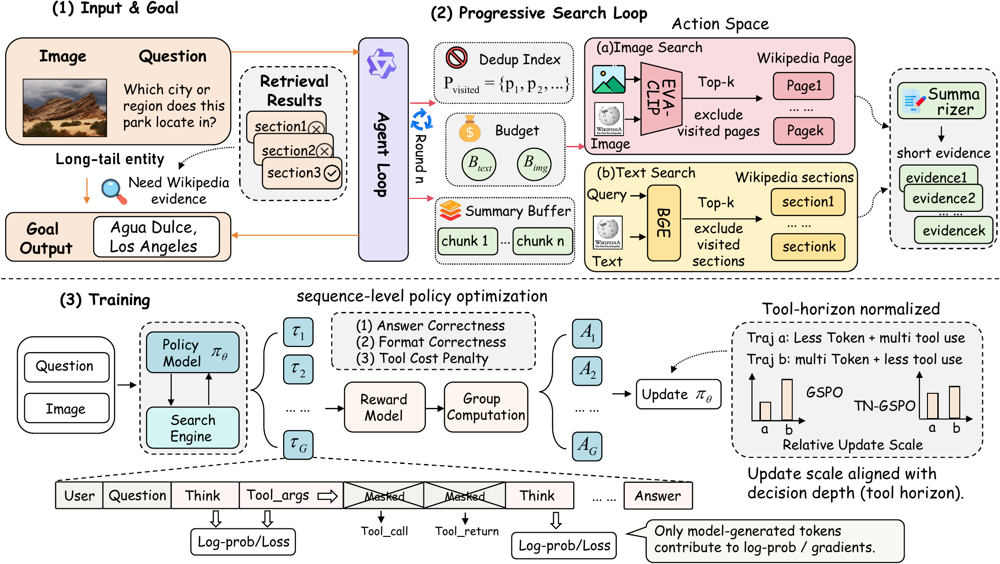
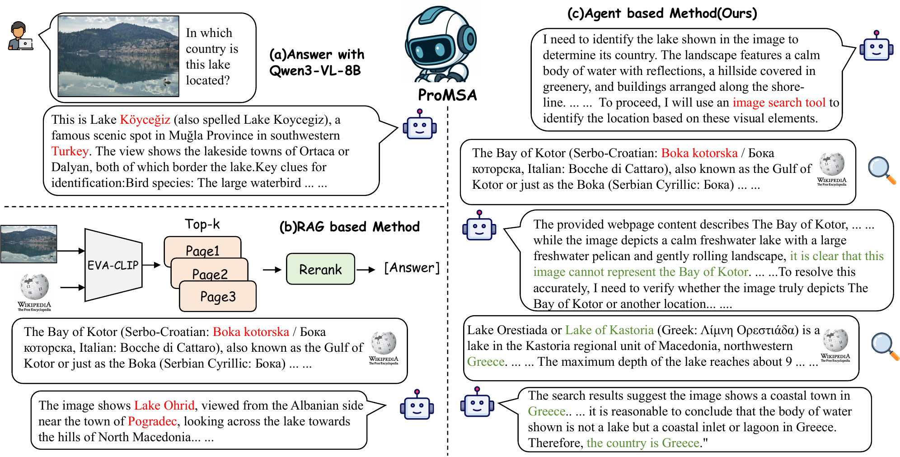
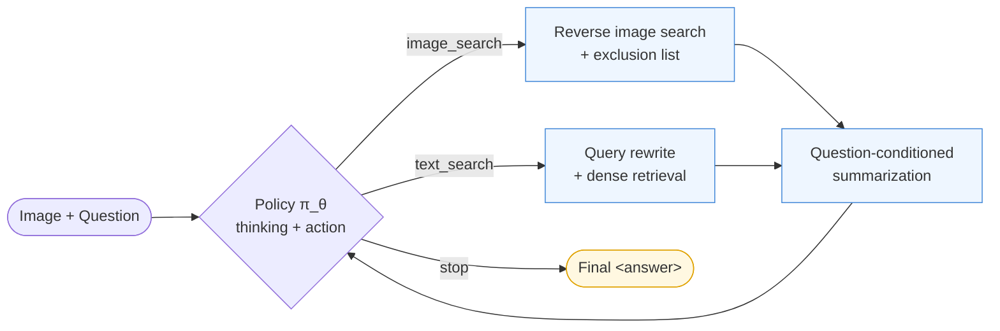
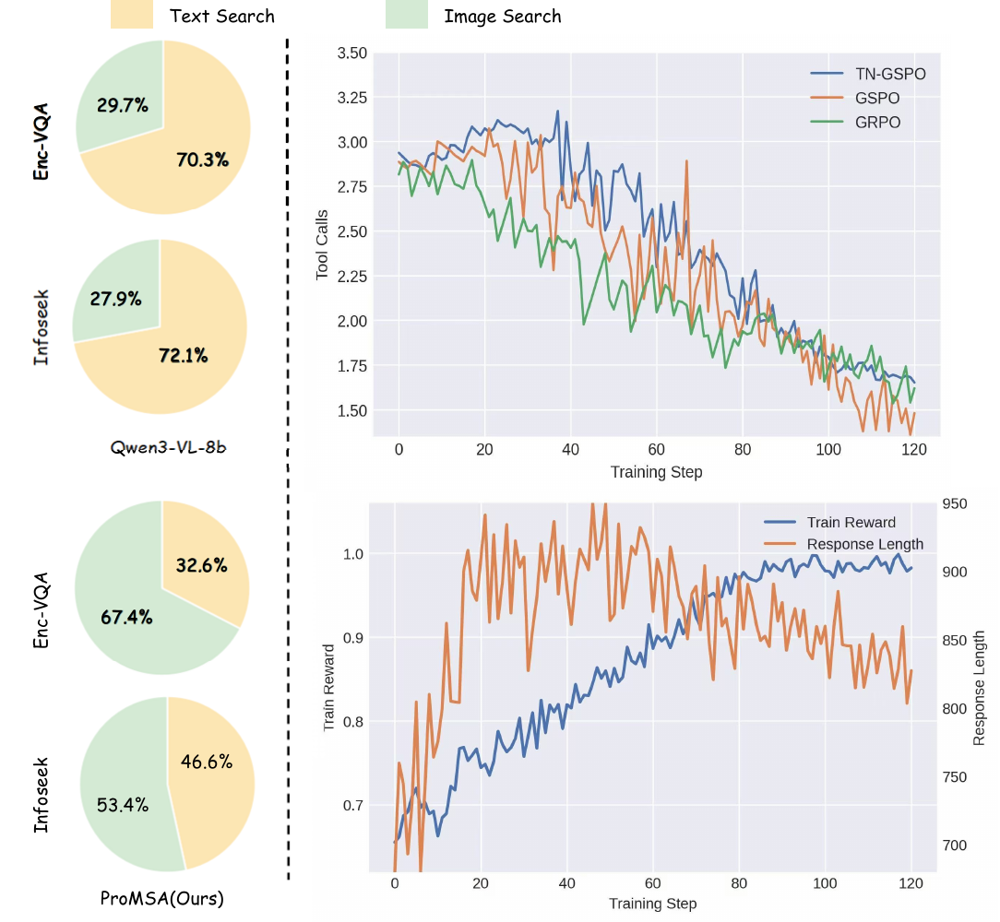
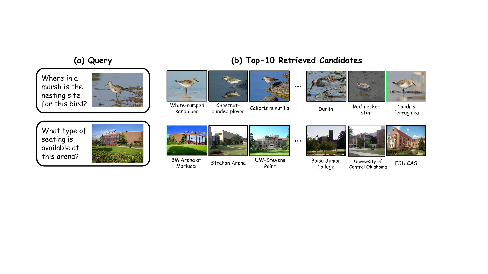
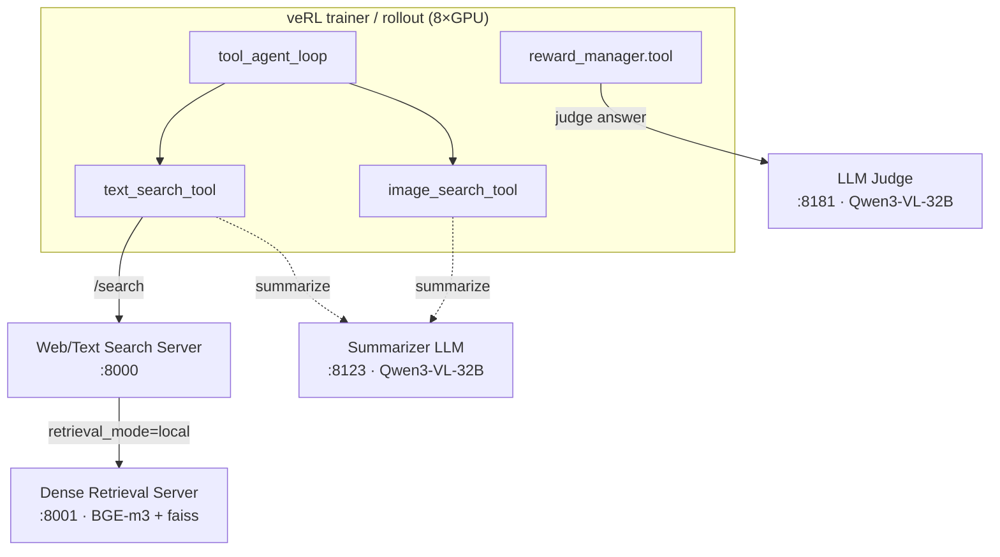

<div align="center">

# ProMSA

### Progressive Multimodal Search Agents for Knowledge-Based Visual Question Answering

[](#-citation)
[](https://dingwu1021.github.io/ProMSA/)
[](LICENSE)
[](https://www.python.org/)
[](https://github.com/volcengine/verl)
[](https://github.com/QwenLM)

*An MLLM agent that learns **when to retrieve, which modality to use, and when to stop** — trained end-to-end with **TN-GSPO**, a tool-horizon-normalized sequence-level RL objective.*

<h3>🎉 Accepted to ECCV 2026</h3>



<sub><b>Overview of ProMSA.</b> (1) Input & goal · (2) the progressive search loop with its image/text/stop action space and de-duplicated retrieval · (3) training with the tool-horizon-normalized sequence-level objective (TN-GSPO).</sub>

</div>

---

## 📖 Table of Contents

- [Overview](#-overview)
- [Highlights](#-highlights)
- [Method](#-method)
- [Results](#-results)
- [Repository Structure](#-repository-structure)
- [Installation](#-installation)
- [Data & Model Preparation](#-data--model-preparation)
- [Service Architecture](#-service-architecture)
- [Launching the Services](#-launching-the-services)
- [Training](#-training)
- [Evaluation](#-evaluation)
- [Configuration Reference](#-configuration-reference)
- [Troubleshooting](#-troubleshooting)
- [Acknowledgements](#-acknowledgements)
- [Citation](#-citation)
- [License](#-license)

---

## 🔭 Overview

**Knowledge-Based Visual Question Answering (KB-VQA)** requires a model to recognize entities in an image and reason with external knowledge (e.g., Wikipedia). Most prior systems use a **fixed retrieve-then-generate** pipeline: a pre-selected retriever, a static top-*k*, and a single retrieval step. This is brittle under long-tail entities — it cannot adapt the retrieval modality, cannot recover from a wrong first retrieval, and cannot build multi-hop evidence chains.

**ProMSA** reframes KB-VQA as a **budgeted, progressive search-and-reason process**. A single multimodal LLM acts as a *budget-aware researcher*: at every step it inspects the evidence gathered so far and chooses one of three actions —

| Action | When it fires | Tool behavior |
|:--|:--|:--|
| 🖼️ `image_search` | The entity in the image is **unknown / uncertain** | Reverse-image retrieval over a Wikipedia KB, with a **de-duplication exclusion list** so repeated calls surface *new* candidates |
| 🔎 `text_search` | The entity is **known** but an attribute / relation is **missing** | Model-rewritten query → dense text retrieval, summarized to a short snippet |
| ✅ `stop` | The evidence is **sufficient** | Emits the final `<answer>` |

Retrieved pages are **summarized** (question-conditioned) before being injected back into the context, keeping the trajectory short under a fixed token & tool-call budget.

<div align="center">

<br>
<sub><b>Direct answering vs. fixed RAG vs. ProMSA.</b> A fixed RAG pipeline drifts to the wrong entity and cannot recover; ProMSA re-searches with de-duplication and switches modality until the evidence supports the answer.</sub>
</div>

> Training is two-stage: **(1)** a rejection-sampling SFT *cold start* to learn valid tool-call formats, then **(2)** reinforcement learning with **TN-GSPO** to learn an effective search policy.

---

## ✨ Highlights

- **🧭 Adaptive multimodal retrieval** — the agent selects image vs. text search per step instead of using a fixed pipeline.
- **🔁 Failure recovery & multi-hop** — explicit de-duplication lets the agent re-search to escape a wrong first retrieval and chain evidence across pages.
- **💰 Budget-aware** — per-tool call budgets + a tool-cost reward penalty teach the model to stop once evidence is enough.
- **🎯 TN-GSPO** — a sequence-level RL objective that normalizes the update by **both** generation length **and** tool-interaction depth, yielding more stable search policies than GRPO / vanilla GSPO.
- **🧩 Drop-in tools** — image & text search are implemented as standard veRL tools; the multi-turn rollout, reward, and loss are all included.

---

## 🧠 Method

### Agent rollout (one trajectory)



Each step the policy emits `(thinking, action, args)` inside `<thinking>…</thinking>` and either `<tool_call>…</tool_call>` or `<answer>…</answer>`. Tool-returned tokens are **masked out of the loss** (`response_mask = 0`); only model-generated tokens are trained.

### TN-GSPO objective

Standard GSPO normalizes the sequence-level likelihood ratio by generation length `L`. In a search agent, trajectory difficulty is driven by **tool-interaction depth** `H`, not raw text length. **TN-GSPO** normalizes by both:

$$D(\tau) = L(\tau)\,\bigl(1 + c\,H(\tau)^{\alpha}\bigr), \qquad r_\theta(\tau) = \exp\!\Bigl(\tfrac{1}{D(\tau)}\textstyle\sum_{t\in T_\text{gen}} \Delta_t\Bigr)$$

where `H = #tool_calls`, with `c = 0.04`, `α = 1.0` by default. The reward combines **answer correctness** (LLM-judge) **+ format** − a **tool-cost penalty** `λ·(#tool_calls / H_max)`, optimized with asymmetric (DAPO "clip-higher") clipping `ε⁻ = 0.2`, `ε⁺ = 0.28`.

> 💡 **Implementation note.** TN-GSPO reuses the standard GSPO loss unchanged. The tool-horizon normalization is applied in [`dp_actor.py`](verl/verl/workers/actor/dp_actor.py) by rescaling `old_log_prob` so that the sequence ratio `Σ Δ / L` becomes `Σ Δ / (L·(1+c·Hᵅ))`. The per-trajectory `H` (`__tool_calls__`) is computed as `len(tool_stats)` in [`agent_loop.py`](verl/verl/experimental/agent_loop/agent_loop.py).

---

## 📊 Results

**Main results** (accuracy). E-VQA uses BEM; InfoSeek uses VQA accuracy.

| Method | Retriever | Model | E-VQA (Single) | E-VQA (All) | InfoSeek (All) |
|:--|:--|:--|:--:|:--:|:--:|
| Qwen3-VL-8B (zero-shot) | — | — | 25.3 | 24.8 | 25.7 |
| MMSearch-R1\* | BGE+EVA-CLIP | Qwen2.5-VL-7B | 40.6 | 40.7 | 39.7 |
| CC-VQA | EVA-CLIP-8B | Qwen2.5-VL-7B | 41.4 | 36.1 | 45.1 |
| REAL | EVA-CLIP-8B | Qwen3-VL-8B | 45.5 | 41.4 | 44.1 |
| **ProMSA (Ours)** | BGE+EVA-CLIP | Qwen2.5-VL-7B | 50.0 | 49.7 | 49.2 |
| **ProMSA (Ours)** | BGE+EVA-CLIP | **Qwen3-VL-8B** | **52.2** | **52.6** | **53.4** |

**Training stages** (avg. over E-VQA + InfoSeek): Base **35.1** → Cold-Start SFT **40.7** → RL (TN-GSPO) **53.0**.

**RL objective ablation** (E-VQA / InfoSeek): GRPO 44.2 / 43.7 · GSPO\* 49.3 / 49.6 · **TN-GSPO\* 52.6 / 53.4**.

<sub>\* asymmetric clipping. See the paper for full tables (tool ablations, budget/top-k sweeps, inference-time analysis, OK-VQA generalization).</sub>

<div align="center">

<br>
<sub><b>Tool usage & training dynamics.</b> Left: text- vs. image-search ratio before/after RL. Right: TN-GSPO keeps the tool-call count in a stable range (GRPO collapses it too fast), while reward rises and responses shorten as the policy converges.</sub>
</div>

<div align="center">

<br>
<sub><b>Retrieval examples.</b> The correct entity may appear at rank-1 or only deep in the candidate list — rank variation that motivates adaptive, multi-round retrieval rather than a fixed top-<i>k</i>.</sub>
</div>

---

## 🗂 Repository Structure

```
.
├── start_all_services.sh          # Launch summarizer + retrieval + web-search (InfoSeek KB)
├── start_all_services-evqa.sh     # Same, for the E-VQA KB
├── search-r1-server.sh            # Launch the dense retrieval server (:8001) — used by the above
├── search-r1-server-evqa.sh       # E-VQA variant (delegates to search-r1-server.sh)
├── Judge-server.sh                # Launch the LLM-judge server (reward / eval)
├── train_multi_node.sh            # Stage-2 RL training (TN-GSPO) — multi-node entry
├── eval_single_node.sh            # Single-node evaluation entry
├── train_infoseek_val.json        # Dataset registries (annotation path + reward_fn + system prompt)
├── train_evqa_val.json
├── test_infoseek.json
├── test_evqa_val.json
├── config/tool_config/
│   ├── tools_train.yaml           # Tool schemas + budgets for training
│   └── tools_val.yaml             # Tool schemas + budgets for validation/eval
├── data/
│   └── data_example.zip           # 2-sample example of the JSONL data format
├── web_search_server/             # FastAPI text/web search + summarization service (port 8000)
├── Search-R1/                     # Dense retrieval server (faiss + BGE/E5)  (port 8001)
└── verl/                          # Forked veRL — the RL engine
    └── verl/
        ├── experimental/agent_loop/tool_agent_loop.py   # Multi-turn search-agent rollout
        ├── tools/{image_search_tool,text_search_tool}.py # The two retrieval tools
        ├── workers/reward_manager/tool.py                # Reward: answer + format − tool cost
        ├── workers/actor/dp_actor.py                     # TN-GSPO normalization
        ├── trainer/ppo/core_algos.py                     # GSPO loss
        └── utils/dataset/rl_dataset_json_v2.py           # Registry-driven dataset loader
```

---

## ⚙️ Installation

> **Tested environment:** Linux · Python 3.10+ · CUDA 12.x · 8×A800 (80 GB) per node · PyTorch 2.7. The 8B RL run in the paper uses 8×A800.

### 1. Clone & create an environment

```bash
git clone <your-repo-url> ProMSA && cd ProMSA
conda create -n promsa python=3.10 -y
conda activate promsa
```

### 2. Install the RL engine (veRL)

```bash
cd verl
pip install -r requirements.txt
# Inference backend used for rollout (one of the two below):
pip install "sglang[all]"        # recommended (configs default to rollout.name=sglang)
# or:  pip install vllm
pip install -e .                 # install this forked verl in editable mode
cd ..
```

### 3. Install the search/summarization services

```bash
# Text / web search server
cd web_search_server
pip install -r requirements.txt
playwright install-deps && playwright install   # only needed for live web search
cd ..

# Dense retrieval server (Search-R1)
cd Search-R1
pip install -r requirements.txt                 # faiss-gpu, transformers, fastapi, ...
cd ..
```

---

## 📦 Data & Model Preparation

### Datasets & knowledge bases

ProMSA trains/evaluates on **[Encyclopedic-VQA (E-VQA)](https://github.com/google-research/google-research/tree/master/encyclopedic_vqa)** and **[InfoSeek](https://github.com/open-vision-language/infoseek)**, each with its own Wikipedia knowledge base (E-VQA ≈ 2M pages; InfoSeek uses a 100K-page retrieval subset, following prior work).

You need to build, per KB:

| Artifact | Used by | Example path (set via env) |
|:--|:--|:--|
| Dense **text index** (`*.faiss`) + passages (`*_meta.jsonl`) | Retrieval server (8001) | `INDEX_PATH`, `CORPUS_PATH` |
| **KB dict** (`wiki_*_dict.json` / `encyclopedic_kb_wiki.json`) | Retrieval server (8001) | `KB_JSON_PATH` |
| Per-sample **annotation** JSONL | Training / eval datasets | `data/<split>/<dataset>/*.jsonl` |

### Data format

A registry JSON (e.g. [`train_infoseek_val.json`](train_infoseek_val.json)) points to a JSONL annotation file and declares the reward functions and system prompt:

```jsonc
{
  "infoseek_val_train": {
    "annotation": "data/train/infoseek/data_1_5w.jsonl",
    "length": 15000,
    "reward_fn": ["llm_score", "format_score"],   // used for the training reward
    "unused_reward_fn": [],                         // logged as metrics only
    "input_template": { "name": "general", "arguments": { "system_prompt": "...<thinking>/<tool_call>/<answer> format..." } }
  }
}
```

Each line of the annotation JSONL is one sample. See `data/data_example.zip` for a runnable 2-sample example:

```jsonc
{
  "data_source": "Enc-VQA",
  "prompt": [{"role": "user", "content": "<image>\nWhere is this bird a migratory species?"}],
  "reward_model": {"ground_truth": ["Europe"], "other_ground_truth": [], "style": "rule"},
  "image": ["/path/to/data/.../image.jpg"],          // absolute path(s) to the question image
  "wikipedia_title": "Ixobrychus minutus",
  "image_search_results": {                           // PRE-COMPUTED reverse-image-search evidence
    "organic": [{"title": "...", "link": "https://en.wikipedia.org/...", "section_texts": ["..."], "thumbnailUrl": "..."}]
  }
}
```

> 🔑 **`image_search` is data-driven.** Reverse-image-search candidates (`image_search_results`) are pre-computed (EVA-CLIP over the KB) and stored in each sample. At rollout time the `image_search_tool` serves the next *unseen* candidate blocks — this is what makes the exclusion/de-dup behavior cheap and reproducible. `text_search` is live (queries the retrieval server).

### Models

Download the backbones and the summarizer/judge model from Hugging Face or ModelScope and point the scripts at them:

- **Policy backbone:** `Qwen/Qwen2.5-VL-7B-Instruct` or `Qwen/Qwen3-VL-2B/8B-Instruct`
- **Summarizer & LLM-Judge:** `Qwen/Qwen3-VL-32B-Instruct` (used to summarize retrieved pages and to judge answer correctness)
- **Text retriever:** `BAAI/bge-m3` · **Image retriever:** EVA-CLIP (used offline to build `image_search_results`)

---

## 🛰 Service Architecture

ProMSA runs as a small constellation of services. The training/eval job (veRL) calls the tools, which call these HTTP services:



| Port | Service | Launched by | Backed by |
|:--:|:--|:--|:--|
| `8123` | Summarizer LLM (question-conditioned page summaries) | `start_all_services*.sh` | SGLang · Qwen3-VL-32B |
| `8001` | Dense text retrieval | `Search-R1/.../retrieval_server.py` | faiss + BGE-m3 |
| `8000` | Text/Web search server (routes `local` retrieval, summarizes) | `start_all_services*.sh` | FastAPI / Uvicorn |
| `8181` | LLM Judge (reward + eval scoring) | `Judge-server.sh` | SGLang · Qwen3-VL-32B |

These map to environment variables consumed by the tool configs and training scripts:

```bash
export TEXT_SEARCH_ADDRESS="<host>:8000"      # web/text search server
export LOCAL_DATABASE_ADDRESS="<host>:8001"   # dense retrieval server
export SUMMARIZER_BASE_URL="http://<host>:8123/v1"
export LLM_JUDGE_URL="<host>:8181"
```

---

## 🚀 Launching the Services

> Start these **before** training/eval. They can run on a dedicated CPU/GPU node; point the training script at their IPs.

### 1. Summarizer + Web-search server (ports 8123 & 8000)

Edit the placeholder paths at the top of the script (`ROOT_DIR`, `INDEX_PATH`, model paths), then:

```bash
# InfoSeek KB
bash start_all_services.sh
# or the E-VQA KB
bash start_all_services-evqa.sh
```

### 2. Dense retrieval server (port 8001)

`start_all_services*.sh` launches this automatically via the bundled `search-r1-server.sh` wrapper. To run it standalone, set the KB paths as environment variables:

```bash
INDEX_PATH=/path/to/wiki/text_index_bge_m3.faiss \
CORPUS_PATH=/path/to/wiki/text_passages_bge_m3_meta.jsonl \
KB_JSON_PATH=/path/to/wiki/wiki_100_dict.json \
RETRIEVER_NAME=bge-m3 RETRIEVER_MODEL=BAAI/bge-m3 TOPK=3 \
bash search-r1-server.sh          # serves on 0.0.0.0:8001 (POST /retrieve)
```

<sub>Use `search-r1-server-evqa.sh` (identical logic) for the E-VQA KB, or set `FAISS_GPU=0` to run faiss on CPU. The wrapper just forwards these to `Search-R1/search_r1/search/retrieval_server.py`.</sub>

### 3. LLM-Judge server (port 8181)

```bash
bash Judge-server.sh   # SGLang server for Qwen3-VL-32B on :8181
```

**Sanity check** all services are up:

```bash
curl -s http://<host>:8123/v1/models      # summarizer
curl -s http://<host>:8001/health         # retrieval (or POST /search)
curl -s http://<host>:8000/health         # web/text search
curl -s http://<host>:8181/v1/models      # judge
```

---

## 🏋️ Training

ProMSA is trained in **two stages**.

### Stage 1 — Cold-Start SFT (rejection sampling)

A small SFT set (~3K trajectories) teaches the model valid tool-call **format** and basic interaction patterns before RL. Build it by **rejection sampling** the base policy and keeping at most one trajectory per question that is (i) format-valid, (ii) executable, (iii) correct. Then fine-tune with **[LLaMA-Factory](https://github.com/hiyouga/LLaMA-Factory)**:

```text
freeze vision encoder + projector · train LM only
lr = 1e-5 · 3 epochs · ~3,000 samples
```

> SFT itself is run with LLaMA-Factory (not bundled here); the resulting checkpoint becomes the `MODEL_PATH` for Stage 2.

### Stage 2 — Reinforcement Learning with TN-GSPO

Edit the **USER CONFIGURATION** block at the top of [`train_multi_node.sh`](train_multi_node.sh) (service IPs, `MODEL_PATH`, `train_files`/`val_files`, output dirs), then launch.

**Single node (8 GPUs):**

```bash
NODE_RANK=0 NNODES=1 bash train_multi_node.sh
```

**Multi-node (e.g. 4 nodes):**

```bash
# Head node
NODE_RANK=0 NNODES=4 bash train_multi_node.sh
# Worker nodes
NODE_RANK=1 MASTER_ADDR=<head_ip> NNODES=4 bash train_multi_node.sh
NODE_RANK=2 MASTER_ADDR=<head_ip> NNODES=4 bash train_multi_node.sh
NODE_RANK=3 MASTER_ADDR=<head_ip> NNODES=4 bash train_multi_node.sh
```

Key flags (already set in the script) that define **TN-GSPO** and the search budget:

```bash
actor_rollout_ref.actor.policy_loss.loss_mode=gspo            # GSPO base
+actor_rollout_ref.actor.policy_loss.tool_len_penalty_c=0.04  # TN-GSPO: c
+actor_rollout_ref.actor.policy_loss.tool_len_penalty_alpha=1.0 # TN-GSPO: α
actor_rollout_ref.actor.clip_ratio_low=0.2                    # asymmetric clip ε⁻
actor_rollout_ref.actor.clip_ratio_high=0.28                  # asymmetric clip ε⁺
actor_rollout_ref.rollout.multi_turn.max_assistant_turns=8    # interaction budget
reward_model.reward_manager=tool                              # answer + format − tool cost
+reward_model.reward_kwargs.tool_call_penalty_weight=0.5      # λ (tool-cost weight)
+reward_model.reward_kwargs.tool_call_penalty_max_calls=7     # H_max
```

Default RL recipe (paper): 15K samples · global batch 128 · lr 1e-6 · `rollout.n=8` · up to 7 interaction steps · 4096 tokens/step, 16384 tokens/trajectory · image & text search ≤ 3 calls each · top-3 retrieval.

Checkpoints, rollout dumps, and logs are written to the `trainer.default_local_dir` / `rollout_data_dir` paths set in the script; `wandb` logging is enabled by default (set `WANDB_API_KEY`).

---

## 📈 Evaluation

Edit the **USER CONFIGURATION** block of [`eval_single_node.sh`](eval_single_node.sh) (service IPs, `MODEL_PATH`, `val_files`), then:

```bash
bash eval_single_node.sh
```

This runs validation-only (`total_epochs=0`, `val_before_train=True`) and scores answers with the LLM judge. Per-sample rollouts are written under `rollout_data_PPU/<exp_name>/validation`. Metrics:

- **E-VQA** — BEM (BERT-based answer matching).
- **InfoSeek** — VQA Accuracy + Relaxed Accuracy (metric depends on question type).

---

## 🔧 Configuration Reference

### Tool config (`config/tool_config/tools_train.yaml`)

```yaml
text_search_tool:                # verl.tools.text_search_tool.TextSearchTool
  text_search_type: local_retrieval
  text_search_topk: 3
  max_text_search_calls: 4       # per-trajectory budget
image_search_tool:               # verl.tools.image_search_tool.ImageSearchTool (data-driven)
  max_image_search_calls: 3      # per-trajectory budget
  image_search_return_k: 3       # unseen blocks served per call (de-dup)
```

### Reward knobs (`reward_model.reward_kwargs` in the train script)

| Key | Meaning | Default |
|:--|:--|:--:|
| `format_score` | bonus for valid `<thinking>/<tool_call>/<answer>` format | 0.5 |
| `tool_call_penalty_weight` | λ — strength of the tool-cost penalty | 0.5 |
| `tool_call_penalty_max_calls` | `H_max` for the cost ratio | 7 |
| `penalize_tool_limit_reached` | penalize hitting the call budget | true |
| `llm_judge_model` / `llm_judge_urls` | judge model & endpoint | — |

---

## 🛠 Troubleshooting

- **Services unreachable / timeouts.** Confirm `TEXT_SEARCH_ADDRESS`, `LOCAL_DATABASE_ADDRESS`, `SUMMARIZER_BASE_URL`, `LLM_JUDGE_URL` point at reachable hosts and that all four ports respond (see the sanity-check curls above).
- **Retrieval server won't start.** Make sure `INDEX_PATH` / `CORPUS_PATH` (and optionally `KB_JSON_PATH`) are set and the faiss/passages files exist. `search-r1-server.sh` will refuse to start if the required paths are missing; set `FAISS_GPU=0` to fall back to CPU faiss.
- **Judge success-rate crash.** The reward manager aborts if the judge success rate drops below `judge_llm_success_threshold` (default 0.95) to avoid training on incomplete rewards — usually a sign the judge server is overloaded; lower `llm_judge_concurrency_limit` or scale the judge.
- **OOM during rollout.** Lower `rollout.gpu_memory_utilization`, `max_num_seqs`, or `ppo_micro_batch_size_per_gpu`; enable `param_offload`.
- **Image paths not found.** The `image` field uses absolute paths. Either regenerate your JSONL with correct paths or use the dataset loader's `path_rewrite_from` / `path_rewrite_to` options.

---

## 🙏 Acknowledgements

ProMSA is built on top of excellent open-source work:

- **[veRL](https://github.com/volcengine/verl)** — the reinforcement-learning engine (forked under `verl/`).
- **[Search-R1](https://github.com/PeterGriffinJin/Search-R1)** — the dense retrieval server (`Search-R1/`).
- **[LLaMA-Factory](https://github.com/hiyouga/LLaMA-Factory)** — used for the cold-start SFT stage.
- **[Qwen2.5-VL / Qwen3-VL](https://github.com/QwenLM)**, **[BGE](https://github.com/FlagOpen/FlagEmbedding)**, **[EVA-CLIP](https://github.com/baaivision/EVA)** — backbones and retrievers.
- Datasets: **[Encyclopedic-VQA](https://github.com/google-research/google-research/tree/master/encyclopedic_vqa)** and **[InfoSeek](https://github.com/open-vision-language/infoseek)**.

---

## 📚 Citation

If you find ProMSA useful, please cite:

```bibtex
@inproceedings{promsa2026,
  title     = {ProMSA: Progressive Multimodal Search Agents for Knowledge-Based Visual Question Answering},
  author    = {Wu, ZhengXian and Xu, Hangrui and Shi, Kai and Chen, Zhuohong and Yu, Yunyao and
               Zhang, Chuanrui and Liao, Zirui and Yang, Jun and Yang, Zhenyu and Lu, Haonan and Wang, Haoqian},
  booktitle = {Proceedings of the European Conference on Computer Vision (ECCV)},
  year      = {2026}
}
```

---

## 📄 License

This project is released under the **Apache License 2.0** — see [LICENSE](LICENSE). Bundled components (`verl/`, `Search-R1/`) retain their own upstream licenses and notices; please respect them.

<div align="center">
<sub>Built for reproducible research on agentic, retrieval-augmented multimodal reasoning.</sub>
</div>
